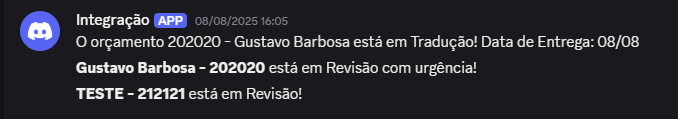
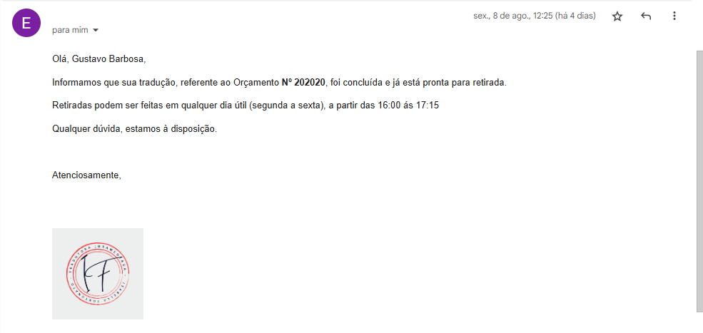
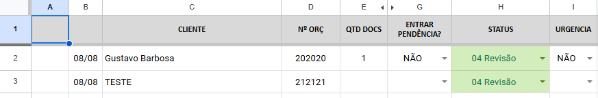

# Automação de Projetos com Google Sheets e Discord

Este projeto em Google Apps Script monitora uma planilha de controle de projetos e envia notificações automáticas via E-mail e Discord com base na alteração de status. O sistema é integrado com a API da Omie para busca de dados de clientes em tempo real, otimizando a comunicação e o fluxo de trabalho.

## ✨ Funcionalidades

   <h2>NOTIFICAÇÃO DISCORD</h2>
  

   <h2>EMAIL</h2>
   

   <h2>TABELA</h2>   
  
   

- **Integração com API Externa:** Busca informações de contato do cliente (e-mail) diretamente da API da Omie em tempo real.
- **Notificação por E-mail com Branding:** Envia um e-mail formatado em HTML com a logo da empresa embutida para o cliente final quando um projeto é marcado como "Pronto".
- **Notificações Inteligentes no Discord:** Publica mensagens em canais específicos quando um projeto entra nos status de "Tradução", "Revisão" e "Assinar Digital".
- **Lógica Condicional Avançada:** A notificação de "Revisão" só é disparada se a data do projeto corresponder ao dia atual e a mensagem é personalizada caso seja marcada como "urgente".
- **Lembrete Mensal Agendado:** Envia uma mensagem para o Discord, mencionando um usuário específico para realizar tarefas administrativas.
- **Gestão Segura de Configurações:** Utiliza o `PropertiesService` para armazenar de forma segura todas as informações sensíveis (chaves de API, URLs de webhook, etc.).
- **Notificação de Erros na Tela:** Informa o usuário na interface da planilha com uma notificação "toast" caso ocorra uma falha no envio de notificações críticas.

## 📂 Estrutura do Projeto

O código é organizado de forma modular para facilitar a manutenção e a escalabilidade:

.

├── Code.gs             # Arquivo principal, contém os gatilhos e constantes globais.

├── Handlers.gs         # Contém a lógica de negócio para cada tipo de notificação.

├── Utilities.gs        # Funções auxiliares reutilizáveis (envio de mensagem, busca na API).

└── Setup.gs            # Script para configuração inicial do ambiente (NÃO ENVIAR COM DADOS).

## 🚀 Instalação e Configuração

Siga estes passos para configurar o projeto em seu próprio ambiente Google.

**1. Copie o Código:**
   - Crie um novo projeto no [Google Apps Script](https://script.google.com).
   - Crie os 4 arquivos de script (`Code.gs`, `Handlers.gs`, `Utilities.gs`, `Setup.gs`) e copie o conteúdo correspondente para cada um.

**2. Configure as Propriedades:**
   - Abra o arquivo `Setup.gs`.
   - Preencha **todas** as propriedades, incluindo as novas chaves da API da Omie (`OMIE_APP_KEY`, `OMIE_APP_SECRET`) e o ID do arquivo da logo (`GOOGLE_DRIVE_LOGO_FILE_ID`).
   - No editor do Apps Script, selecione a função `configurarPropriedades` e clique em **Executar**.
   - **IMPORTANTE:** Após a execução, apague seus dados do arquivo `Setup.gs`, deixando apenas os textos de exemplo (`INSIRA_...`) antes de enviar ao GitHub.

**3. Configure os Gatilhos (Acionadores):**
   - No menu à esquerda, clique em **Acionadores** (ícone de relógio).
   - Crie os dois gatilhos necessários:
     - **Gatilho 1 (para edições):** Função `masterOnEdit`, Evento `Da planilha`, Tipo `Ao editar`.
     - **Gatilho 2 (para lembrete):** Função `enviarLembreteMensal`, Evento `Acionador de tempo`, Tipo `Mensal`.

## 🛠️ Detalhamento das Funções

### 📄 `Code.gs` (Arquivo Principal)
- **`masterOnEdit(e)`**: O coração do projeto. É acionado a cada edição, calcula dinamicamente o nome da aba do mês atual e atua como um **roteador**, chamando o *handler* apropriado com base no status alterado.
- **`enviarLembreteMensal()`**: Acionado por tempo, chama o *handler* que envia o lembrete mensal.

### 📄 `Handlers.gs` (Lógica das Ações)
- **`handleEmailPronto(planilha, linha)`**: Busca o e-mail do cliente via API da Omie, prepara um e-mail em HTML, anexa a logo da empresa e envia a notificação de "Projeto Pronto".
- **`handleDiscordRevisao(planilha, linha)`**: Verifica se a data do projeto na planilha é a data de hoje. Se for, verifica se há uma marcação de urgência para personalizar a mensagem e solicita o envio para o Discord.
- **Demais Handlers**: `handleDiscordTraducao`, `handleDiscordAssinatura` e `handleLembreteMensal` montam as mensagens específicas para cada contexto e solicitam o envio.

### 📄 `Utilities.gs` (Funções Auxiliares)
- **`buscarEmailClienteOmie(nome)`**: Conecta-se à API da Omie com as credenciais salvas, busca por um cliente pelo `nome_fantasia` e retorna seu e-mail.
- **`enviarMensagemDiscord(...)`**: Função genérica que envia mensagens para qualquer webhook do Discord configurado.
- **`formatarData(data)`**: Converte um objeto de data para o formato de texto `dd/mm`.

### 📄 `Setup.gs` (Configuração)
- **`configurarPropriedades()`**: Função de uso único para salvar todas as configurações e chaves secretas no `PropertiesService`.

## ⚙️ Referência de Propriedades

A tabela abaixo detalha todas as chaves que devem ser configuradas no arquivo `Setup.gs`.

| Chave da Propriedade                | Descrição                                                                         |
| ----------------------------------- | --------------------------------------------------------------------------------- |
| `NOME_DA_ABA_CLIENTES`              | Nome da aba de clientes (atualmente sem uso principal, mas pode ser útil no futuro). |
| `VALOR_STATUS_PRONTO`               | Texto do status que dispara o envio de e-mail.                                    |
| `VALOR_STATUS_TRADUCAO`             | Texto do status que dispara a notificação de "Tradução".                          |
| `VALOR_STATUS_REVISAO`              | Texto do status que dispara a notificação de "Revisão".                           |
| `VALOR_STATUS_ASSINAR_DIGITAL`      | Texto do status que dispara a notificação de "Assinar Digital".                   |
| `REMETENTE_EMAIL`                   | E-mail (configurado como alias no Gmail) para o envio das notificações.           |
| `REMETENTE_NOME`                    | Nome que aparecerá como remetente do e-mail.                                      |
| `GOOGLE_DRIVE_LOGO_FILE_ID`         | ID do arquivo da imagem da logo, armazenado no Google Drive.                      |
| `OMIE_APP_KEY`                      | Chave de aplicação (`App Key`) para acesso à API da Omie.                         |
| `OMIE_APP_SECRET`                   | Chave secreta (`App Secret`) para acesso à API da Omie.                           |
| `OMIE_API_URL`                      | URL base do endpoint da API da Omie que será consultado.                          |
| `WEBHOOK_URL_TRADUCAO`              | URL do Webhook do Discord para notificações de "Tradução".                        |
| `WEBHOOK_URL_REVISAO`               | URL do Webhook do Discord para notificações de "Revisão".                         |
| `WEBHOOK_URL_ASSINAR_DIGITAL`       | URL do Webhook do Discord para notificações de "Assinar Digital".                 |
| `WEBHOOK_URL_LEMBRETE_MENSAL`       | URL do Webhook do Discord para o lembrete mensal.                                 |
| `DISCORD_USER_ID_PARA_PING`         | ID do usuário do Discord a ser mencionado no lembrete mensal.                     |

## ⚖️ Licença

Distribuído sob a licença MIT.
